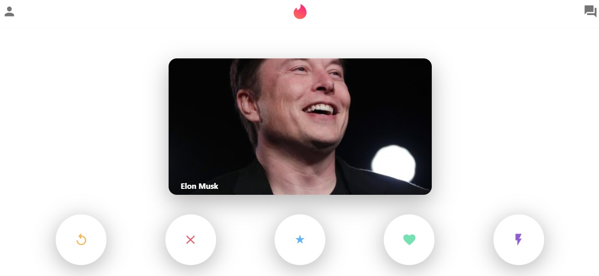

# Tinder Clone
Just a basic tinderclone app for working on mern stack

## Front-end
I used react and I hosted this on firebase

tan-tinderclone.web.app/

## Back-end 
I used node.js  and express for connect to database and I used mongoose for connecting mongoDB. 
For hosting my back-end I used heroku

## Quick Preview

